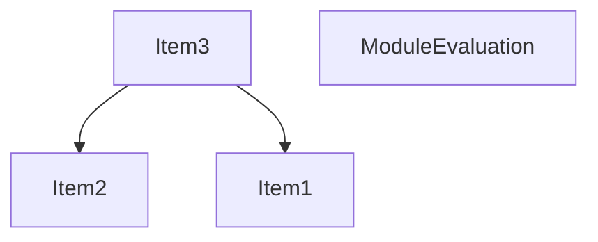
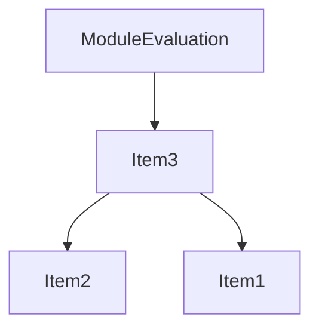
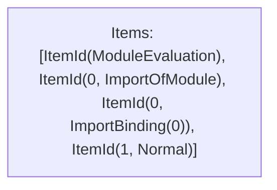

# Items

Count: 4

## Item 1: Stmt 0, `ImportOfModule`

```js
import { baz } from './module';

```

- Hoisted
- Side effects

## Item 2: Stmt 0, `ImportBinding(0)`

```js
import { baz } from './module';

```

- Hoisted
- Declares: `baz`

## Item 3: Stmt 1, `Normal`

```js
if (1 + 1 == 3) {
    baz();
}

```

- Side effects
- Reads: `baz`

# Phase 1

# Phase 2

# Phase 3

# Phase 4

# Final

# Entrypoints

```
{
    ModuleEvaluation: 0,
    Exports: 1,
}
```


# Modules (dev)
## Part 0
```js
"module evaluation";
import './module';
import { baz } from './module';
if (1 + 1 == 3) {
    baz();
}
export { baz as a } from "__TURBOPACK_VAR__" assert {
    __turbopack_var__: true
};

```
## Part 1
```js

```
## Merged (module eval)
```js
import './module';
import { baz } from './module';
"module evaluation";
if (1 + 1 == 3) {
    baz();
}
export { baz as a } from "__TURBOPACK_VAR__" assert {
    __turbopack_var__: true
};

```
# Entrypoints

```
{
    ModuleEvaluation: 0,
    Exports: 1,
}
```


# Modules (prod)
## Part 0
```js
"module evaluation";
import './module';
import { baz } from './module';
if (1 + 1 == 3) {
    baz();
}
export { baz as a } from "__TURBOPACK_VAR__" assert {
    __turbopack_var__: true
};

```
## Part 1
```js

```
## Merged (module eval)
```js
import './module';
import { baz } from './module';
"module evaluation";
if (1 + 1 == 3) {
    baz();
}
export { baz as a } from "__TURBOPACK_VAR__" assert {
    __turbopack_var__: true
};

```
