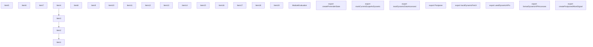
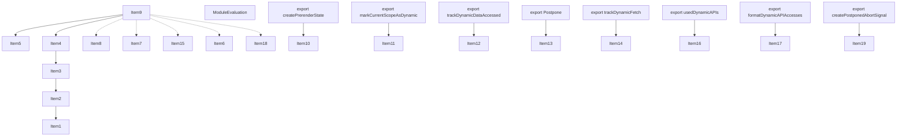
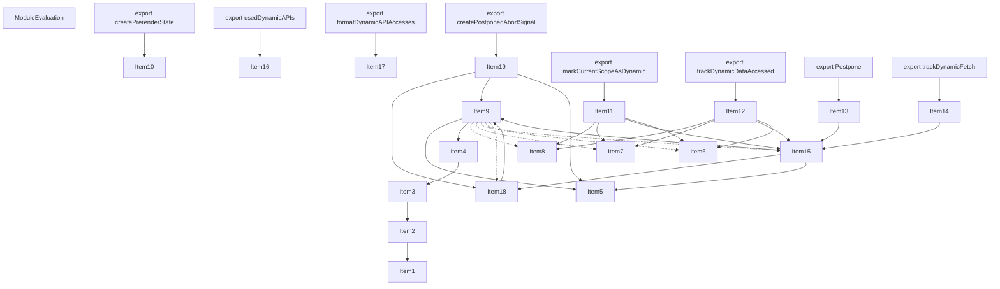
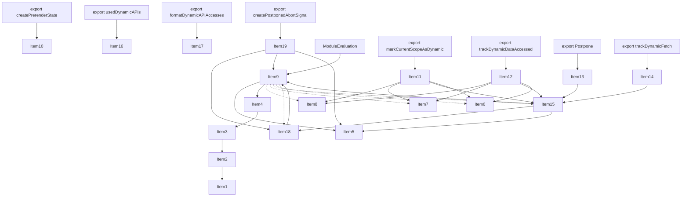

# Items

Count: 28

## Item 1: Stmt 0, `ImportOfModule`

```js
import React from 'react';

```

- Hoisted
- Side effects

## Item 2: Stmt 0, `ImportBinding(0)`

```js
import React from 'react';

```

- Hoisted
- Declares: `React`

## Item 3: Stmt 1, `ImportOfModule`

```js
import { DynamicServerError } from '../../client/components/hooks-server-context';

```

- Hoisted
- Side effects

## Item 4: Stmt 1, `ImportBinding(0)`

```js
import { DynamicServerError } from '../../client/components/hooks-server-context';

```

- Hoisted
- Declares: `DynamicServerError`

## Item 5: Stmt 2, `ImportOfModule`

```js
import { StaticGenBailoutError } from '../../client/components/static-generation-bailout';

```

- Hoisted
- Side effects

## Item 6: Stmt 2, `ImportBinding(0)`

```js
import { StaticGenBailoutError } from '../../client/components/static-generation-bailout';

```

- Hoisted
- Declares: `StaticGenBailoutError`

## Item 7: Stmt 3, `ImportOfModule`

```js
import { getPathname } from '../../lib/url';

```

- Hoisted
- Side effects

## Item 8: Stmt 3, `ImportBinding(0)`

```js
import { getPathname } from '../../lib/url';

```

- Hoisted
- Declares: `getPathname`

## Item 9: Stmt 4, `VarDeclarator(0)`

```js
const hasPostpone = typeof React.unstable_postpone === 'function';

```

- Side effects
- Declares: `hasPostpone`
- Reads: `React`
- Write: `React`, `hasPostpone`

## Item 10: Stmt 5, `Normal`

```js
export function createPrerenderState(isDebugSkeleton) {
    return {
        isDebugSkeleton,
        dynamicAccesses: []
    };
}

```

- Hoisted
- Declares: `createPrerenderState`
- Write: `createPrerenderState`

## Item 11: Stmt 6, `Normal`

```js
export function markCurrentScopeAsDynamic(store, expression) {
    const pathname = getPathname(store.urlPathname);
    if (store.isUnstableCacheCallback) {
        return;
    } else if (store.dynamicShouldError) {
        throw new StaticGenBailoutError(`Route ${pathname} with \`dynamic = "error"\` couldn't be rendered statically because it used \`${expression}\`. See more info here: https://nextjs.org/docs/app/building-your-application/rendering/static-and-dynamic#dynamic-rendering`);
    } else if (store.prerenderState) {
        postponeWithTracking(store.prerenderState, expression, pathname);
    } else {
        store.revalidate = 0;
        if (store.isStaticGeneration) {
            const err = new DynamicServerError(`Route ${pathname} couldn't be rendered statically because it used ${expression}. See more info here: https://nextjs.org/docs/messages/dynamic-server-error`);
            store.dynamicUsageDescription = expression;
            store.dynamicUsageStack = err.stack;
            throw err;
        }
    }
}

```

- Hoisted
- Declares: `markCurrentScopeAsDynamic`
- Reads (eventual): `getPathname`, `StaticGenBailoutError`, `postponeWithTracking`, `DynamicServerError`
- Write: `markCurrentScopeAsDynamic`

## Item 12: Stmt 7, `Normal`

```js
export function trackDynamicDataAccessed(store, expression) {
    const pathname = getPathname(store.urlPathname);
    if (store.isUnstableCacheCallback) {
        throw new Error(`Route ${pathname} used "${expression}" inside a function cached with "unstable_cache(...)". Accessing Dynamic data sources inside a cache scope is not supported. If you need this data inside a cached function use "${expression}" outside of the cached function and pass the required dynamic data in as an argument. See more info here: https://nextjs.org/docs/app/api-reference/functions/unstable_cache`);
    } else if (store.dynamicShouldError) {
        throw new StaticGenBailoutError(`Route ${pathname} with \`dynamic = "error"\` couldn't be rendered statically because it used \`${expression}\`. See more info here: https://nextjs.org/docs/app/building-your-application/rendering/static-and-dynamic#dynamic-rendering`);
    } else if (store.prerenderState) {
        postponeWithTracking(store.prerenderState, expression, pathname);
    } else {
        store.revalidate = 0;
        if (store.isStaticGeneration) {
            const err = new DynamicServerError(`Route ${pathname} couldn't be rendered statically because it used ${expression}. See more info here: https://nextjs.org/docs/messages/dynamic-server-error`);
            store.dynamicUsageDescription = expression;
            store.dynamicUsageStack = err.stack;
            throw err;
        }
    }
}

```

- Hoisted
- Declares: `trackDynamicDataAccessed`
- Reads (eventual): `getPathname`, `StaticGenBailoutError`, `postponeWithTracking`, `DynamicServerError`
- Write: `trackDynamicDataAccessed`

## Item 13: Stmt 8, `Normal`

```js
export function Postpone({ reason, prerenderState, pathname }) {
    postponeWithTracking(prerenderState, reason, pathname);
}

```

- Hoisted
- Declares: `Postpone`
- Reads (eventual): `postponeWithTracking`
- Write: `Postpone`

## Item 14: Stmt 9, `Normal`

```js
export function trackDynamicFetch(store, expression) {
    if (!store.prerenderState || store.isUnstableCacheCallback) return;
    postponeWithTracking(store.prerenderState, expression, store.urlPathname);
}

```

- Hoisted
- Declares: `trackDynamicFetch`
- Reads (eventual): `postponeWithTracking`
- Write: `trackDynamicFetch`

## Item 15: Stmt 10, `Normal`

```js
function postponeWithTracking(prerenderState, expression, pathname) {
    assertPostpone();
    const reason = `Route ${pathname} needs to bail out of prerendering at this point because it used ${expression}. ` + `React throws this special object to indicate where. It should not be caught by ` + `your own try/catch. Learn more: https://nextjs.org/docs/messages/ppr-caught-error`;
    prerenderState.dynamicAccesses.push({
        stack: prerenderState.isDebugSkeleton ? new Error().stack : undefined,
        expression
    });
    React.unstable_postpone(reason);
}

```

- Hoisted
- Declares: `postponeWithTracking`
- Reads (eventual): `assertPostpone`, `React`
- Write: `postponeWithTracking`
- Write (eventual): `React`

## Item 16: Stmt 11, `Normal`

```js
export function usedDynamicAPIs(prerenderState) {
    return prerenderState.dynamicAccesses.length > 0;
}

```

- Hoisted
- Declares: `usedDynamicAPIs`
- Write: `usedDynamicAPIs`

## Item 17: Stmt 12, `Normal`

```js
export function formatDynamicAPIAccesses(prerenderState) {
    return prerenderState.dynamicAccesses.filter((access)=>typeof access.stack === 'string' && access.stack.length > 0).map(({ expression, stack })=>{
        stack = stack.split('\n').slice(4).filter((line)=>{
            if (line.includes('node_modules/next/')) {
                return false;
            }
            if (line.includes(' (<anonymous>)')) {
                return false;
            }
            if (line.includes(' (node:')) {
                return false;
            }
            return true;
        }).join('\n');
        return `Dynamic API Usage Debug - ${expression}:\n${stack}`;
    });
}

```

- Hoisted
- Declares: `formatDynamicAPIAccesses`
- Write: `formatDynamicAPIAccesses`

## Item 18: Stmt 13, `Normal`

```js
function assertPostpone() {
    if (!hasPostpone) {
        throw new Error(`Invariant: React.unstable_postpone is not defined. This suggests the wrong version of React was loaded. This is a bug in Next.js`);
    }
}

```

- Hoisted
- Declares: `assertPostpone`
- Reads (eventual): `hasPostpone`
- Write: `assertPostpone`

## Item 19: Stmt 14, `Normal`

```js
export function createPostponedAbortSignal(reason) {
    assertPostpone();
    const controller = new AbortController();
    try {
        React.unstable_postpone(reason);
    } catch (x) {
        controller.abort(x);
    }
    return controller.signal;
}

```

- Hoisted
- Declares: `createPostponedAbortSignal`
- Reads (eventual): `assertPostpone`, `React`
- Write: `createPostponedAbortSignal`
- Write (eventual): `React`

# Phase 1

# Phase 2

# Phase 3

# Phase 4

# Final

```mermaid
graph TD
    N0["Items: [ItemId(ModuleEvaluation)]"];
    N1["Items: [ItemId(Export((&quot;Postpone&quot;, #2), &quot;Postpone&quot;))]"];
    N2["Items: [ItemId(Export((&quot;createPostponedAbortSignal&quot;, #2), &quot;createPostponedAbortSignal&quot;))]"];
    N3["Items: [ItemId(Export((&quot;createPrerenderState&quot;, #2), &quot;createPrerenderState&quot;))]"];
    N4["Items: [ItemId(Export((&quot;formatDynamicAPIAccesses&quot;, #2), &quot;formatDynamicAPIAccesses&quot;))]"];
    N5["Items: [ItemId(Export((&quot;markCurrentScopeAsDynamic&quot;, #2), &quot;markCurrentScopeAsDynamic&quot;))]"];
    N6["Items: [ItemId(Export((&quot;trackDynamicDataAccessed&quot;, #2), &quot;trackDynamicDataAccessed&quot;))]"];
    N7["Items: [ItemId(Export((&quot;trackDynamicFetch&quot;, #2), &quot;trackDynamicFetch&quot;))]"];
    N8["Items: [ItemId(Export((&quot;usedDynamicAPIs&quot;, #2), &quot;usedDynamicAPIs&quot;))]"];
    N9["Items: [ItemId(0, ImportBinding(0))]"];
    N10["Items: [ItemId(1, ImportBinding(0))]"];
    N11["Items: [ItemId(2, ImportBinding(0))]"];
    N12["Items: [ItemId(3, ImportBinding(0))]"];
    N13["Items: [ItemId(4, VarDeclarator(0)), ItemId(10, Normal), ItemId(13, Normal)]"];
    N14["Items: [ItemId(6, Normal)]"];
    N15["Items: [ItemId(7, Normal)]"];
    N16["Items: [ItemId(8, Normal)]"];
    N17["Items: [ItemId(9, Normal)]"];
    N18["Items: [ItemId(0, ImportOfModule)]"];
    N19["Items: [ItemId(1, ImportOfModule)]"];
    N20["Items: [ItemId(2, ImportOfModule)]"];
    N21["Items: [ItemId(3, ImportOfModule)]"];
    N22["Items: [ItemId(5, Normal)]"];
    N23["Items: [ItemId(11, Normal)]"];
    N24["Items: [ItemId(12, Normal)]"];
    N25["Items: [ItemId(14, Normal)]"];
    N6 --> N12;
    N6 --> N13;
    N1 --> N13;
    N13 --> N9;
    N7 --> N13;
    N13 -.-> N12;
    N13 -.-> N11;
    N13 -.-> N10;
    N5 --> N13;
    N5 --> N14;
    N6 --> N15;
    N1 --> N16;
    N7 --> N17;
    N5 --> N11;
    N5 --> N12;
    N6 --> N10;
    N14 --> N12;
    N14 --> N11;
    N14 --> N13;
    N14 --> N10;
    N15 --> N12;
    N15 --> N11;
    N15 --> N13;
    N15 --> N10;
    N16 --> N13;
    N17 --> N13;
    N2 --> N9;
    N2 --> N13;
    N0 --> N13;
    N5 --> N10;
    N6 --> N11;
```

# Entrypoints

```
{
    ModuleEvaluation: 0,
    Export(
        "createPrerenderState",
    ): 3,
    Export(
        "markCurrentScopeAsDynamic",
    ): 5,
    Export(
        "usedDynamicAPIs",
    ): 8,
    Export(
        "Postpone",
    ): 1,
    Export(
        "trackDynamicDataAccessed",
    ): 6,
    Export(
        "trackDynamicFetch",
    ): 7,
    Export(
        "createPostponedAbortSignal",
    ): 2,
    Export(
        "formatDynamicAPIAccesses",
    ): 4,
    Exports: 26,
}
```


# Modules (dev)
## Part 0
```js
import "__TURBOPACK_PART__" assert {
    __turbopack_part__: 13
};
"module evaluation";

```
## Part 1
```js
import { a as Postpone } from "__TURBOPACK_PART__" assert {
    __turbopack_part__: -16
};
import "__TURBOPACK_PART__" assert {
    __turbopack_part__: 13
};
export { Postpone };

```
## Part 2
```js
import { b as createPostponedAbortSignal } from "__TURBOPACK_PART__" assert {
    __turbopack_part__: -25
};
import "__TURBOPACK_PART__" assert {
    __turbopack_part__: 9
};
import "__TURBOPACK_PART__" assert {
    __turbopack_part__: 13
};
export { createPostponedAbortSignal };

```
## Part 3
```js
import { c as createPrerenderState } from "__TURBOPACK_PART__" assert {
    __turbopack_part__: -22
};
export { createPrerenderState };

```
## Part 4
```js
import { d as formatDynamicAPIAccesses } from "__TURBOPACK_PART__" assert {
    __turbopack_part__: -24
};
export { formatDynamicAPIAccesses };

```
## Part 5
```js
import { e as markCurrentScopeAsDynamic } from "__TURBOPACK_PART__" assert {
    __turbopack_part__: -14
};
import "__TURBOPACK_PART__" assert {
    __turbopack_part__: 13
};
import "__TURBOPACK_PART__" assert {
    __turbopack_part__: 11
};
import "__TURBOPACK_PART__" assert {
    __turbopack_part__: 12
};
import "__TURBOPACK_PART__" assert {
    __turbopack_part__: 10
};
export { markCurrentScopeAsDynamic };

```
## Part 6
```js
import { f as trackDynamicDataAccessed } from "__TURBOPACK_PART__" assert {
    __turbopack_part__: -15
};
import "__TURBOPACK_PART__" assert {
    __turbopack_part__: 12
};
import "__TURBOPACK_PART__" assert {
    __turbopack_part__: 13
};
import "__TURBOPACK_PART__" assert {
    __turbopack_part__: 10
};
import "__TURBOPACK_PART__" assert {
    __turbopack_part__: 11
};
export { trackDynamicDataAccessed };

```
## Part 7
```js
import { g as trackDynamicFetch } from "__TURBOPACK_PART__" assert {
    __turbopack_part__: -17
};
import "__TURBOPACK_PART__" assert {
    __turbopack_part__: 13
};
export { trackDynamicFetch };

```
## Part 8
```js
import { h as usedDynamicAPIs } from "__TURBOPACK_PART__" assert {
    __turbopack_part__: -23
};
export { usedDynamicAPIs };

```
## Part 9
```js
import React from 'react';
export { React as i } from "__TURBOPACK_VAR__" assert {
    __turbopack_var__: true
};

```
## Part 10
```js
import { DynamicServerError } from '../../client/components/hooks-server-context';
export { DynamicServerError as j } from "__TURBOPACK_VAR__" assert {
    __turbopack_var__: true
};

```
## Part 11
```js
import { StaticGenBailoutError } from '../../client/components/static-generation-bailout';
export { StaticGenBailoutError as k } from "__TURBOPACK_VAR__" assert {
    __turbopack_var__: true
};

```
## Part 12
```js
import { getPathname } from '../../lib/url';
export { getPathname as l } from "__TURBOPACK_VAR__" assert {
    __turbopack_var__: true
};

```
## Part 13
```js
import "__TURBOPACK_PART__" assert {
    __turbopack_part__: -9
};
import React from 'react';
import "__TURBOPACK_PART__" assert {
    __turbopack_part__: 12
};
import "__TURBOPACK_PART__" assert {
    __turbopack_part__: 11
};
import "__TURBOPACK_PART__" assert {
    __turbopack_part__: 10
};
const hasPostpone = typeof React.unstable_postpone === 'function';
function postponeWithTracking(prerenderState, expression, pathname) {
    assertPostpone();
    const reason = `Route ${pathname} needs to bail out of prerendering at this point because it used ${expression}. ` + `React throws this special object to indicate where. It should not be caught by ` + `your own try/catch. Learn more: https://nextjs.org/docs/messages/ppr-caught-error`;
    prerenderState.dynamicAccesses.push({
        stack: prerenderState.isDebugSkeleton ? new Error().stack : undefined,
        expression
    });
    React.unstable_postpone(reason);
}
function assertPostpone() {
    if (!hasPostpone) {
        throw new Error(`Invariant: React.unstable_postpone is not defined. This suggests the wrong version of React was loaded. This is a bug in Next.js`);
    }
}
export { hasPostpone as m } from "__TURBOPACK_VAR__" assert {
    __turbopack_var__: true
};
export { postponeWithTracking as n } from "__TURBOPACK_VAR__" assert {
    __turbopack_var__: true
};
export { assertPostpone as o } from "__TURBOPACK_VAR__" assert {
    __turbopack_var__: true
};

```
## Part 14
```js
import "__TURBOPACK_PART__" assert {
    __turbopack_part__: -10
};
import { DynamicServerError } from '../../client/components/hooks-server-context';
import "__TURBOPACK_PART__" assert {
    __turbopack_part__: -12
};
import { getPathname } from '../../lib/url';
import "__TURBOPACK_PART__" assert {
    __turbopack_part__: -11
};
import { StaticGenBailoutError } from '../../client/components/static-generation-bailout';
import { n as postponeWithTracking } from "__TURBOPACK_PART__" assert {
    __turbopack_part__: -13
};
function markCurrentScopeAsDynamic(store, expression) {
    const pathname = getPathname(store.urlPathname);
    if (store.isUnstableCacheCallback) {
        return;
    } else if (store.dynamicShouldError) {
        throw new StaticGenBailoutError(`Route ${pathname} with \`dynamic = "error"\` couldn't be rendered statically because it used \`${expression}\`. See more info here: https://nextjs.org/docs/app/building-your-application/rendering/static-and-dynamic#dynamic-rendering`);
    } else if (store.prerenderState) {
        postponeWithTracking(store.prerenderState, expression, pathname);
    } else {
        store.revalidate = 0;
        if (store.isStaticGeneration) {
            const err = new DynamicServerError(`Route ${pathname} couldn't be rendered statically because it used ${expression}. See more info here: https://nextjs.org/docs/messages/dynamic-server-error`);
            store.dynamicUsageDescription = expression;
            store.dynamicUsageStack = err.stack;
            throw err;
        }
    }
}
export { markCurrentScopeAsDynamic as e } from "__TURBOPACK_VAR__" assert {
    __turbopack_var__: true
};

```
## Part 15
```js
import "__TURBOPACK_PART__" assert {
    __turbopack_part__: -10
};
import { DynamicServerError } from '../../client/components/hooks-server-context';
import "__TURBOPACK_PART__" assert {
    __turbopack_part__: -12
};
import { getPathname } from '../../lib/url';
import "__TURBOPACK_PART__" assert {
    __turbopack_part__: -11
};
import { StaticGenBailoutError } from '../../client/components/static-generation-bailout';
import { n as postponeWithTracking } from "__TURBOPACK_PART__" assert {
    __turbopack_part__: -13
};
function trackDynamicDataAccessed(store, expression) {
    const pathname = getPathname(store.urlPathname);
    if (store.isUnstableCacheCallback) {
        throw new Error(`Route ${pathname} used "${expression}" inside a function cached with "unstable_cache(...)". Accessing Dynamic data sources inside a cache scope is not supported. If you need this data inside a cached function use "${expression}" outside of the cached function and pass the required dynamic data in as an argument. See more info here: https://nextjs.org/docs/app/api-reference/functions/unstable_cache`);
    } else if (store.dynamicShouldError) {
        throw new StaticGenBailoutError(`Route ${pathname} with \`dynamic = "error"\` couldn't be rendered statically because it used \`${expression}\`. See more info here: https://nextjs.org/docs/app/building-your-application/rendering/static-and-dynamic#dynamic-rendering`);
    } else if (store.prerenderState) {
        postponeWithTracking(store.prerenderState, expression, pathname);
    } else {
        store.revalidate = 0;
        if (store.isStaticGeneration) {
            const err = new DynamicServerError(`Route ${pathname} couldn't be rendered statically because it used ${expression}. See more info here: https://nextjs.org/docs/messages/dynamic-server-error`);
            store.dynamicUsageDescription = expression;
            store.dynamicUsageStack = err.stack;
            throw err;
        }
    }
}
export { trackDynamicDataAccessed as f } from "__TURBOPACK_VAR__" assert {
    __turbopack_var__: true
};

```
## Part 16
```js
import { n as postponeWithTracking } from "__TURBOPACK_PART__" assert {
    __turbopack_part__: -13
};
function Postpone({ reason, prerenderState, pathname }) {
    postponeWithTracking(prerenderState, reason, pathname);
}
export { Postpone as a } from "__TURBOPACK_VAR__" assert {
    __turbopack_var__: true
};

```
## Part 17
```js
import { n as postponeWithTracking } from "__TURBOPACK_PART__" assert {
    __turbopack_part__: -13
};
function trackDynamicFetch(store, expression) {
    if (!store.prerenderState || store.isUnstableCacheCallback) return;
    postponeWithTracking(store.prerenderState, expression, store.urlPathname);
}
export { trackDynamicFetch as g } from "__TURBOPACK_VAR__" assert {
    __turbopack_var__: true
};

```
## Part 18
```js
import 'react';

```
## Part 19
```js
import '../../client/components/hooks-server-context';

```
## Part 20
```js
import '../../client/components/static-generation-bailout';

```
## Part 21
```js
import '../../lib/url';

```
## Part 22
```js
function createPrerenderState(isDebugSkeleton) {
    return {
        isDebugSkeleton,
        dynamicAccesses: []
    };
}
export { createPrerenderState as c } from "__TURBOPACK_VAR__" assert {
    __turbopack_var__: true
};

```
## Part 23
```js
function usedDynamicAPIs(prerenderState) {
    return prerenderState.dynamicAccesses.length > 0;
}
export { usedDynamicAPIs as h } from "__TURBOPACK_VAR__" assert {
    __turbopack_var__: true
};

```
## Part 24
```js
function formatDynamicAPIAccesses(prerenderState) {
    return prerenderState.dynamicAccesses.filter((access)=>typeof access.stack === 'string' && access.stack.length > 0).map(({ expression, stack })=>{
        stack = stack.split('\n').slice(4).filter((line)=>{
            if (line.includes('node_modules/next/')) {
                return false;
            }
            if (line.includes(' (<anonymous>)')) {
                return false;
            }
            if (line.includes(' (node:')) {
                return false;
            }
            return true;
        }).join('\n');
        return `Dynamic API Usage Debug - ${expression}:\n${stack}`;
    });
}
export { formatDynamicAPIAccesses as d } from "__TURBOPACK_VAR__" assert {
    __turbopack_var__: true
};

```
## Part 25
```js
import "__TURBOPACK_PART__" assert {
    __turbopack_part__: -9
};
import React from 'react';
import { o as assertPostpone } from "__TURBOPACK_PART__" assert {
    __turbopack_part__: -13
};
function createPostponedAbortSignal(reason) {
    assertPostpone();
    const controller = new AbortController();
    try {
        React.unstable_postpone(reason);
    } catch (x) {
        controller.abort(x);
    }
    return controller.signal;
}
export { createPostponedAbortSignal as b } from "__TURBOPACK_VAR__" assert {
    __turbopack_var__: true
};

```
## Part 26
```js
export { Postpone } from "__TURBOPACK_PART__" assert {
    __turbopack_part__: "export Postpone"
};
export { createPostponedAbortSignal } from "__TURBOPACK_PART__" assert {
    __turbopack_part__: "export createPostponedAbortSignal"
};
export { createPrerenderState } from "__TURBOPACK_PART__" assert {
    __turbopack_part__: "export createPrerenderState"
};
export { formatDynamicAPIAccesses } from "__TURBOPACK_PART__" assert {
    __turbopack_part__: "export formatDynamicAPIAccesses"
};
export { markCurrentScopeAsDynamic } from "__TURBOPACK_PART__" assert {
    __turbopack_part__: "export markCurrentScopeAsDynamic"
};
export { trackDynamicDataAccessed } from "__TURBOPACK_PART__" assert {
    __turbopack_part__: "export trackDynamicDataAccessed"
};
export { trackDynamicFetch } from "__TURBOPACK_PART__" assert {
    __turbopack_part__: "export trackDynamicFetch"
};
export { usedDynamicAPIs } from "__TURBOPACK_PART__" assert {
    __turbopack_part__: "export usedDynamicAPIs"
};

```
## Merged (module eval)
```js
import "__TURBOPACK_PART__" assert {
    __turbopack_part__: 13
};
"module evaluation";

```
# Entrypoints

```
{
    ModuleEvaluation: 0,
    Export(
        "createPrerenderState",
    ): 3,
    Export(
        "markCurrentScopeAsDynamic",
    ): 5,
    Export(
        "usedDynamicAPIs",
    ): 8,
    Export(
        "Postpone",
    ): 1,
    Export(
        "trackDynamicDataAccessed",
    ): 6,
    Export(
        "trackDynamicFetch",
    ): 7,
    Export(
        "createPostponedAbortSignal",
    ): 2,
    Export(
        "formatDynamicAPIAccesses",
    ): 4,
    Exports: 28,
}
```


# Modules (prod)
## Part 0
```js
import "__TURBOPACK_PART__" assert {
    __turbopack_part__: 13
};
"module evaluation";

```
## Part 1
```js
import { a as Postpone } from "__TURBOPACK_PART__" assert {
    __turbopack_part__: -24
};
import "__TURBOPACK_PART__" assert {
    __turbopack_part__: 16
};
export { Postpone };

```
## Part 2
```js
import { b as createPostponedAbortSignal } from "__TURBOPACK_PART__" assert {
    __turbopack_part__: -18
};
import "__TURBOPACK_PART__" assert {
    __turbopack_part__: 17
};
import "__TURBOPACK_PART__" assert {
    __turbopack_part__: 9
};
import "__TURBOPACK_PART__" assert {
    __turbopack_part__: 13
};
export { createPostponedAbortSignal };

```
## Part 3
```js
import { c as createPrerenderState } from "__TURBOPACK_PART__" assert {
    __turbopack_part__: -23
};
export { createPrerenderState };

```
## Part 4
```js
import { d as formatDynamicAPIAccesses } from "__TURBOPACK_PART__" assert {
    __turbopack_part__: -27
};
export { formatDynamicAPIAccesses };

```
## Part 5
```js
import { e as markCurrentScopeAsDynamic } from "__TURBOPACK_PART__" assert {
    __turbopack_part__: -14
};
import "__TURBOPACK_PART__" assert {
    __turbopack_part__: 11
};
import "__TURBOPACK_PART__" assert {
    __turbopack_part__: 10
};
import "__TURBOPACK_PART__" assert {
    __turbopack_part__: 12
};
import "__TURBOPACK_PART__" assert {
    __turbopack_part__: 16
};
export { markCurrentScopeAsDynamic };

```
## Part 6
```js
import { f as trackDynamicDataAccessed } from "__TURBOPACK_PART__" assert {
    __turbopack_part__: -15
};
import "__TURBOPACK_PART__" assert {
    __turbopack_part__: 11
};
import "__TURBOPACK_PART__" assert {
    __turbopack_part__: 16
};
import "__TURBOPACK_PART__" assert {
    __turbopack_part__: 12
};
import "__TURBOPACK_PART__" assert {
    __turbopack_part__: 10
};
export { trackDynamicDataAccessed };

```
## Part 7
```js
import { g as trackDynamicFetch } from "__TURBOPACK_PART__" assert {
    __turbopack_part__: -25
};
import "__TURBOPACK_PART__" assert {
    __turbopack_part__: 16
};
export { trackDynamicFetch };

```
## Part 8
```js
import { h as usedDynamicAPIs } from "__TURBOPACK_PART__" assert {
    __turbopack_part__: -26
};
export { usedDynamicAPIs };

```
## Part 9
```js
import React from 'react';
export { React as i } from "__TURBOPACK_VAR__" assert {
    __turbopack_var__: true
};

```
## Part 10
```js
import { DynamicServerError } from '../../client/components/hooks-server-context';
export { DynamicServerError as j } from "__TURBOPACK_VAR__" assert {
    __turbopack_var__: true
};

```
## Part 11
```js
import { StaticGenBailoutError } from '../../client/components/static-generation-bailout';
export { StaticGenBailoutError as k } from "__TURBOPACK_VAR__" assert {
    __turbopack_var__: true
};

```
## Part 12
```js
import { getPathname } from '../../lib/url';
export { getPathname as l } from "__TURBOPACK_VAR__" assert {
    __turbopack_var__: true
};

```
## Part 13
```js
import "__TURBOPACK_PART__" assert {
    __turbopack_part__: -9
};
import React from 'react';
const hasPostpone = typeof React.unstable_postpone === 'function';
export { hasPostpone as m } from "__TURBOPACK_VAR__" assert {
    __turbopack_var__: true
};

```
## Part 14
```js
import "__TURBOPACK_PART__" assert {
    __turbopack_part__: -10
};
import { DynamicServerError } from '../../client/components/hooks-server-context';
import "__TURBOPACK_PART__" assert {
    __turbopack_part__: -12
};
import { getPathname } from '../../lib/url';
import "__TURBOPACK_PART__" assert {
    __turbopack_part__: -11
};
import { StaticGenBailoutError } from '../../client/components/static-generation-bailout';
import { n as postponeWithTracking } from "__TURBOPACK_PART__" assert {
    __turbopack_part__: -16
};
function markCurrentScopeAsDynamic(store, expression) {
    const pathname = getPathname(store.urlPathname);
    if (store.isUnstableCacheCallback) {
        return;
    } else if (store.dynamicShouldError) {
        throw new StaticGenBailoutError(`Route ${pathname} with \`dynamic = "error"\` couldn't be rendered statically because it used \`${expression}\`. See more info here: https://nextjs.org/docs/app/building-your-application/rendering/static-and-dynamic#dynamic-rendering`);
    } else if (store.prerenderState) {
        postponeWithTracking(store.prerenderState, expression, pathname);
    } else {
        store.revalidate = 0;
        if (store.isStaticGeneration) {
            const err = new DynamicServerError(`Route ${pathname} couldn't be rendered statically because it used ${expression}. See more info here: https://nextjs.org/docs/messages/dynamic-server-error`);
            store.dynamicUsageDescription = expression;
            store.dynamicUsageStack = err.stack;
            throw err;
        }
    }
}
export { markCurrentScopeAsDynamic as e } from "__TURBOPACK_VAR__" assert {
    __turbopack_var__: true
};

```
## Part 15
```js
import "__TURBOPACK_PART__" assert {
    __turbopack_part__: -10
};
import { DynamicServerError } from '../../client/components/hooks-server-context';
import "__TURBOPACK_PART__" assert {
    __turbopack_part__: -12
};
import { getPathname } from '../../lib/url';
import "__TURBOPACK_PART__" assert {
    __turbopack_part__: -11
};
import { StaticGenBailoutError } from '../../client/components/static-generation-bailout';
import { n as postponeWithTracking } from "__TURBOPACK_PART__" assert {
    __turbopack_part__: -16
};
function trackDynamicDataAccessed(store, expression) {
    const pathname = getPathname(store.urlPathname);
    if (store.isUnstableCacheCallback) {
        throw new Error(`Route ${pathname} used "${expression}" inside a function cached with "unstable_cache(...)". Accessing Dynamic data sources inside a cache scope is not supported. If you need this data inside a cached function use "${expression}" outside of the cached function and pass the required dynamic data in as an argument. See more info here: https://nextjs.org/docs/app/api-reference/functions/unstable_cache`);
    } else if (store.dynamicShouldError) {
        throw new StaticGenBailoutError(`Route ${pathname} with \`dynamic = "error"\` couldn't be rendered statically because it used \`${expression}\`. See more info here: https://nextjs.org/docs/app/building-your-application/rendering/static-and-dynamic#dynamic-rendering`);
    } else if (store.prerenderState) {
        postponeWithTracking(store.prerenderState, expression, pathname);
    } else {
        store.revalidate = 0;
        if (store.isStaticGeneration) {
            const err = new DynamicServerError(`Route ${pathname} couldn't be rendered statically because it used ${expression}. See more info here: https://nextjs.org/docs/messages/dynamic-server-error`);
            store.dynamicUsageDescription = expression;
            store.dynamicUsageStack = err.stack;
            throw err;
        }
    }
}
export { trackDynamicDataAccessed as f } from "__TURBOPACK_VAR__" assert {
    __turbopack_var__: true
};

```
## Part 16
```js
import "__TURBOPACK_PART__" assert {
    __turbopack_part__: -9
};
import React from 'react';
import { o as assertPostpone } from "__TURBOPACK_PART__" assert {
    __turbopack_part__: -17
};
import "__TURBOPACK_PART__" assert {
    __turbopack_part__: 13
};
function postponeWithTracking(prerenderState, expression, pathname) {
    assertPostpone();
    const reason = `Route ${pathname} needs to bail out of prerendering at this point because it used ${expression}. ` + `React throws this special object to indicate where. It should not be caught by ` + `your own try/catch. Learn more: https://nextjs.org/docs/messages/ppr-caught-error`;
    prerenderState.dynamicAccesses.push({
        stack: prerenderState.isDebugSkeleton ? new Error().stack : undefined,
        expression
    });
    React.unstable_postpone(reason);
}
export { postponeWithTracking as n } from "__TURBOPACK_VAR__" assert {
    __turbopack_var__: true
};

```
## Part 17
```js
import { m as hasPostpone } from "__TURBOPACK_PART__" assert {
    __turbopack_part__: -13
};
function assertPostpone() {
    if (!hasPostpone) {
        throw new Error(`Invariant: React.unstable_postpone is not defined. This suggests the wrong version of React was loaded. This is a bug in Next.js`);
    }
}
export { assertPostpone as o } from "__TURBOPACK_VAR__" assert {
    __turbopack_var__: true
};

```
## Part 18
```js
import "__TURBOPACK_PART__" assert {
    __turbopack_part__: -9
};
import React from 'react';
import { o as assertPostpone } from "__TURBOPACK_PART__" assert {
    __turbopack_part__: -17
};
import "__TURBOPACK_PART__" assert {
    __turbopack_part__: 13
};
function createPostponedAbortSignal(reason) {
    assertPostpone();
    const controller = new AbortController();
    try {
        React.unstable_postpone(reason);
    } catch (x) {
        controller.abort(x);
    }
    return controller.signal;
}
export { createPostponedAbortSignal as b } from "__TURBOPACK_VAR__" assert {
    __turbopack_var__: true
};

```
## Part 19
```js
import 'react';

```
## Part 20
```js
import '../../client/components/hooks-server-context';

```
## Part 21
```js
import '../../client/components/static-generation-bailout';

```
## Part 22
```js
import '../../lib/url';

```
## Part 23
```js
function createPrerenderState(isDebugSkeleton) {
    return {
        isDebugSkeleton,
        dynamicAccesses: []
    };
}
export { createPrerenderState as c } from "__TURBOPACK_VAR__" assert {
    __turbopack_var__: true
};

```
## Part 24
```js
import { n as postponeWithTracking } from "__TURBOPACK_PART__" assert {
    __turbopack_part__: -16
};
function Postpone({ reason, prerenderState, pathname }) {
    postponeWithTracking(prerenderState, reason, pathname);
}
export { Postpone as a } from "__TURBOPACK_VAR__" assert {
    __turbopack_var__: true
};

```
## Part 25
```js
import { n as postponeWithTracking } from "__TURBOPACK_PART__" assert {
    __turbopack_part__: -16
};
function trackDynamicFetch(store, expression) {
    if (!store.prerenderState || store.isUnstableCacheCallback) return;
    postponeWithTracking(store.prerenderState, expression, store.urlPathname);
}
export { trackDynamicFetch as g } from "__TURBOPACK_VAR__" assert {
    __turbopack_var__: true
};

```
## Part 26
```js
function usedDynamicAPIs(prerenderState) {
    return prerenderState.dynamicAccesses.length > 0;
}
export { usedDynamicAPIs as h } from "__TURBOPACK_VAR__" assert {
    __turbopack_var__: true
};

```
## Part 27
```js
function formatDynamicAPIAccesses(prerenderState) {
    return prerenderState.dynamicAccesses.filter((access)=>typeof access.stack === 'string' && access.stack.length > 0).map(({ expression, stack })=>{
        stack = stack.split('\n').slice(4).filter((line)=>{
            if (line.includes('node_modules/next/')) {
                return false;
            }
            if (line.includes(' (<anonymous>)')) {
                return false;
            }
            if (line.includes(' (node:')) {
                return false;
            }
            return true;
        }).join('\n');
        return `Dynamic API Usage Debug - ${expression}:\n${stack}`;
    });
}
export { formatDynamicAPIAccesses as d } from "__TURBOPACK_VAR__" assert {
    __turbopack_var__: true
};

```
## Part 28
```js
export { Postpone } from "__TURBOPACK_PART__" assert {
    __turbopack_part__: "export Postpone"
};
export { createPostponedAbortSignal } from "__TURBOPACK_PART__" assert {
    __turbopack_part__: "export createPostponedAbortSignal"
};
export { createPrerenderState } from "__TURBOPACK_PART__" assert {
    __turbopack_part__: "export createPrerenderState"
};
export { formatDynamicAPIAccesses } from "__TURBOPACK_PART__" assert {
    __turbopack_part__: "export formatDynamicAPIAccesses"
};
export { markCurrentScopeAsDynamic } from "__TURBOPACK_PART__" assert {
    __turbopack_part__: "export markCurrentScopeAsDynamic"
};
export { trackDynamicDataAccessed } from "__TURBOPACK_PART__" assert {
    __turbopack_part__: "export trackDynamicDataAccessed"
};
export { trackDynamicFetch } from "__TURBOPACK_PART__" assert {
    __turbopack_part__: "export trackDynamicFetch"
};
export { usedDynamicAPIs } from "__TURBOPACK_PART__" assert {
    __turbopack_part__: "export usedDynamicAPIs"
};

```
## Merged (module eval)
```js
import "__TURBOPACK_PART__" assert {
    __turbopack_part__: 13
};
"module evaluation";

```
