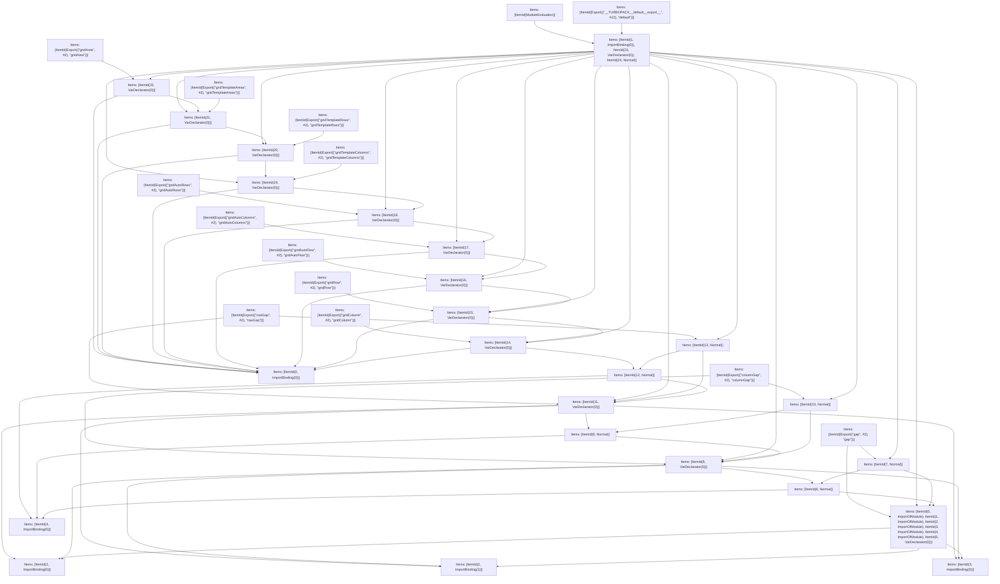

# Items

Count: 45

## Item 1: Stmt 0, `ImportOfModule`

```js
import style from './style';

```

- Hoisted
- Side effects

## Item 2: Stmt 0, `ImportBinding(0)`

```js
import style from './style';

```

- Hoisted
- Declares: `style`

## Item 3: Stmt 1, `ImportOfModule`

```js
import compose from './compose';

```

- Hoisted
- Side effects

## Item 4: Stmt 1, `ImportBinding(0)`

```js
import compose from './compose';

```

- Hoisted
- Declares: `compose`

## Item 5: Stmt 2, `ImportOfModule`

```js
import { createUnaryUnit, getValue } from './spacing';

```

- Hoisted
- Side effects

## Item 6: Stmt 2, `ImportBinding(0)`

```js
import { createUnaryUnit, getValue } from './spacing';

```

- Hoisted
- Declares: `createUnaryUnit`

## Item 7: Stmt 2, `ImportBinding(1)`

```js
import { createUnaryUnit, getValue } from './spacing';

```

- Hoisted
- Declares: `getValue`

## Item 8: Stmt 3, `ImportOfModule`

```js
import { handleBreakpoints } from './breakpoints';

```

- Hoisted
- Side effects

## Item 9: Stmt 3, `ImportBinding(0)`

```js
import { handleBreakpoints } from './breakpoints';

```

- Hoisted
- Declares: `handleBreakpoints`

## Item 10: Stmt 4, `ImportOfModule`

```js
import responsivePropType from './responsivePropType';

```

- Hoisted
- Side effects

## Item 11: Stmt 4, `ImportBinding(0)`

```js
import responsivePropType from './responsivePropType';

```

- Hoisted
- Declares: `responsivePropType`

## Item 12: Stmt 5, `VarDeclarator(0)`

```js
export const gap = (props)=>{
    if (props.gap !== undefined && props.gap !== null) {
        const transformer = createUnaryUnit(props.theme, 'spacing', 8, 'gap');
        const styleFromPropValue = (propValue)=>({
                gap: getValue(transformer, propValue)
            });
        return handleBreakpoints(props, props.gap, styleFromPropValue);
    }
    return null;
};

```

- Side effects
- Declares: `gap`
- Reads: `createUnaryUnit`, `getValue`, `handleBreakpoints`
- Write: `gap`

## Item 13: Stmt 6, `Normal`

```js
gap.propTypes = process.env.NODE_ENV !== 'production' ? {
    gap: responsivePropType
} : {};

```

- Side effects
- Reads: `gap`, `responsivePropType`
- Write: `gap`

## Item 14: Stmt 7, `Normal`

```js
gap.filterProps = [
    'gap'
];

```

- Reads: `gap`
- Write: `gap`

## Item 15: Stmt 8, `VarDeclarator(0)`

```js
export const columnGap = (props)=>{
    if (props.columnGap !== undefined && props.columnGap !== null) {
        const transformer = createUnaryUnit(props.theme, 'spacing', 8, 'columnGap');
        const styleFromPropValue = (propValue)=>({
                columnGap: getValue(transformer, propValue)
            });
        return handleBreakpoints(props, props.columnGap, styleFromPropValue);
    }
    return null;
};

```

- Side effects
- Declares: `columnGap`
- Reads: `createUnaryUnit`, `getValue`, `handleBreakpoints`
- Write: `columnGap`

## Item 16: Stmt 9, `Normal`

```js
columnGap.propTypes = process.env.NODE_ENV !== 'production' ? {
    columnGap: responsivePropType
} : {};

```

- Side effects
- Reads: `columnGap`, `responsivePropType`
- Write: `columnGap`

## Item 17: Stmt 10, `Normal`

```js
columnGap.filterProps = [
    'columnGap'
];

```

- Reads: `columnGap`
- Write: `columnGap`

## Item 18: Stmt 11, `VarDeclarator(0)`

```js
export const rowGap = (props)=>{
    if (props.rowGap !== undefined && props.rowGap !== null) {
        const transformer = createUnaryUnit(props.theme, 'spacing', 8, 'rowGap');
        const styleFromPropValue = (propValue)=>({
                rowGap: getValue(transformer, propValue)
            });
        return handleBreakpoints(props, props.rowGap, styleFromPropValue);
    }
    return null;
};

```

- Side effects
- Declares: `rowGap`
- Reads: `createUnaryUnit`, `getValue`, `handleBreakpoints`
- Write: `rowGap`

## Item 19: Stmt 12, `Normal`

```js
rowGap.propTypes = process.env.NODE_ENV !== 'production' ? {
    rowGap: responsivePropType
} : {};

```

- Side effects
- Reads: `rowGap`, `responsivePropType`
- Write: `rowGap`

## Item 20: Stmt 13, `Normal`

```js
rowGap.filterProps = [
    'rowGap'
];

```

- Reads: `rowGap`
- Write: `rowGap`

## Item 21: Stmt 14, `VarDeclarator(0)`

```js
export const gridColumn = style({
    prop: 'gridColumn'
});

```

- Side effects
- Declares: `gridColumn`
- Reads: `style`
- Write: `gridColumn`

## Item 22: Stmt 15, `VarDeclarator(0)`

```js
export const gridRow = style({
    prop: 'gridRow'
});

```

- Side effects
- Declares: `gridRow`
- Reads: `style`
- Write: `gridRow`

## Item 23: Stmt 16, `VarDeclarator(0)`

```js
export const gridAutoFlow = style({
    prop: 'gridAutoFlow'
});

```

- Side effects
- Declares: `gridAutoFlow`
- Reads: `style`
- Write: `gridAutoFlow`

## Item 24: Stmt 17, `VarDeclarator(0)`

```js
export const gridAutoColumns = style({
    prop: 'gridAutoColumns'
});

```

- Side effects
- Declares: `gridAutoColumns`
- Reads: `style`
- Write: `gridAutoColumns`

## Item 25: Stmt 18, `VarDeclarator(0)`

```js
export const gridAutoRows = style({
    prop: 'gridAutoRows'
});

```

- Side effects
- Declares: `gridAutoRows`
- Reads: `style`
- Write: `gridAutoRows`

## Item 26: Stmt 19, `VarDeclarator(0)`

```js
export const gridTemplateColumns = style({
    prop: 'gridTemplateColumns'
});

```

- Side effects
- Declares: `gridTemplateColumns`
- Reads: `style`
- Write: `gridTemplateColumns`

## Item 27: Stmt 20, `VarDeclarator(0)`

```js
export const gridTemplateRows = style({
    prop: 'gridTemplateRows'
});

```

- Side effects
- Declares: `gridTemplateRows`
- Reads: `style`
- Write: `gridTemplateRows`

## Item 28: Stmt 21, `VarDeclarator(0)`

```js
export const gridTemplateAreas = style({
    prop: 'gridTemplateAreas'
});

```

- Side effects
- Declares: `gridTemplateAreas`
- Reads: `style`
- Write: `gridTemplateAreas`

## Item 29: Stmt 22, `VarDeclarator(0)`

```js
export const gridArea = style({
    prop: 'gridArea'
});

```

- Side effects
- Declares: `gridArea`
- Reads: `style`
- Write: `gridArea`

## Item 30: Stmt 23, `VarDeclarator(0)`

```js
const grid = compose(gap, columnGap, rowGap, gridColumn, gridRow, gridAutoFlow, gridAutoColumns, gridAutoRows, gridTemplateColumns, gridTemplateRows, gridTemplateAreas, gridArea);

```

- Side effects
- Declares: `grid`
- Reads: `compose`, `gap`, `columnGap`, `rowGap`, `gridColumn`, `gridRow`, `gridAutoFlow`, `gridAutoColumns`, `gridAutoRows`, `gridTemplateColumns`, `gridTemplateRows`, `gridTemplateAreas`, `gridArea`
- Write: `grid`

## Item 31: Stmt 24, `Normal`

```js
export default grid;

```

- Side effects
- Declares: `__TURBOPACK__default__export__`
- Reads: `grid`
- Write: `__TURBOPACK__default__export__`

# Phase 1

# Phase 2

# Phase 3

# Phase 4

# Final

# Entrypoints

```
{
    ModuleEvaluation: 0,
    Export(
        "gap",
    ): 3,
    Export(
        "gridAutoRows",
    ): 7,
    Export(
        "gridTemplateColumns",
    ): 11,
    Export(
        "columnGap",
    ): 2,
    Export(
        "gridArea",
    ): 4,
    Exports: 38,
    Export(
        "gridAutoFlow",
    ): 6,
    Export(
        "gridColumn",
    ): 8,
    Export(
        "gridAutoColumns",
    ): 5,
    Export(
        "rowGap",
    ): 13,
    Export(
        "gridTemplateRows",
    ): 12,
    Export(
        "gridTemplateAreas",
    ): 10,
    Export(
        "default",
    ): 1,
    Export(
        "gridRow",
    ): 9,
}
```


# Modules (dev)
## Part 0
```js
import "__TURBOPACK_PART__" assert {
    __turbopack_part__: 16
};
"module evaluation";

```
## Part 1
```js
import "__TURBOPACK_PART__" assert {
    __turbopack_part__: -16
};
import compose from './compose';
export { __TURBOPACK__default__export__ as default };

```
## Part 2
```js
import { a as columnGap } from "__TURBOPACK_PART__" assert {
    __turbopack_part__: -23
};
import "__TURBOPACK_PART__" assert {
    __turbopack_part__: 25
};
export { columnGap };

```
## Part 3
```js
import { b as gap } from "__TURBOPACK_PART__" assert {
    __turbopack_part__: -14
};
import "__TURBOPACK_PART__" assert {
    __turbopack_part__: 22
};
export { gap };

```
## Part 4
```js
import { c as gridArea } from "__TURBOPACK_PART__" assert {
    __turbopack_part__: -37
};
export { gridArea };

```
## Part 5
```js
import { d as gridAutoColumns } from "__TURBOPACK_PART__" assert {
    __turbopack_part__: -32
};
export { gridAutoColumns };

```
## Part 6
```js
import { e as gridAutoFlow } from "__TURBOPACK_PART__" assert {
    __turbopack_part__: -31
};
export { gridAutoFlow };

```
## Part 7
```js
import { f as gridAutoRows } from "__TURBOPACK_PART__" assert {
    __turbopack_part__: -33
};
export { gridAutoRows };

```
## Part 8
```js
import { g as gridColumn } from "__TURBOPACK_PART__" assert {
    __turbopack_part__: -29
};
export { gridColumn };

```
## Part 9
```js
import { h as gridRow } from "__TURBOPACK_PART__" assert {
    __turbopack_part__: -30
};
export { gridRow };

```
## Part 10
```js
import { i as gridTemplateAreas } from "__TURBOPACK_PART__" assert {
    __turbopack_part__: -36
};
export { gridTemplateAreas };

```
## Part 11
```js
import { j as gridTemplateColumns } from "__TURBOPACK_PART__" assert {
    __turbopack_part__: -34
};
export { gridTemplateColumns };

```
## Part 12
```js
import { k as gridTemplateRows } from "__TURBOPACK_PART__" assert {
    __turbopack_part__: -35
};
export { gridTemplateRows };

```
## Part 13
```js
import { l as rowGap } from "__TURBOPACK_PART__" assert {
    __turbopack_part__: -26
};
import "__TURBOPACK_PART__" assert {
    __turbopack_part__: 28
};
export { rowGap };

```
## Part 14
```js
import "__TURBOPACK_PART__" assert {
    __turbopack_part__: -17
};
import { createUnaryUnit } from './spacing';
import "__TURBOPACK_PART__" assert {
    __turbopack_part__: -18
};
import { getValue } from './spacing';
import "__TURBOPACK_PART__" assert {
    __turbopack_part__: -19
};
import { handleBreakpoints } from './breakpoints';
import './style';
import './compose';
import './spacing';
import './breakpoints';
import './responsivePropType';
const gap = (props)=>{
    if (props.gap !== undefined && props.gap !== null) {
        const transformer = createUnaryUnit(props.theme, 'spacing', 8, 'gap');
        const styleFromPropValue = (propValue)=>({
                gap: getValue(transformer, propValue)
            });
        return handleBreakpoints(props, props.gap, styleFromPropValue);
    }
    return null;
};
export { gap as b } from "__TURBOPACK_VAR__" assert {
    __turbopack_var__: true
};

```
## Part 15
```js
import style from './style';
export { style as m } from "__TURBOPACK_VAR__" assert {
    __turbopack_var__: true
};

```
## Part 16
```js
import { c as gridArea } from "__TURBOPACK_PART__" assert {
    __turbopack_part__: -37
};
import { b as gap } from "__TURBOPACK_PART__" assert {
    __turbopack_part__: -14
};
import { a as columnGap } from "__TURBOPACK_PART__" assert {
    __turbopack_part__: -23
};
import { l as rowGap } from "__TURBOPACK_PART__" assert {
    __turbopack_part__: -26
};
import { g as gridColumn } from "__TURBOPACK_PART__" assert {
    __turbopack_part__: -29
};
import { h as gridRow } from "__TURBOPACK_PART__" assert {
    __turbopack_part__: -30
};
import { e as gridAutoFlow } from "__TURBOPACK_PART__" assert {
    __turbopack_part__: -31
};
import { d as gridAutoColumns } from "__TURBOPACK_PART__" assert {
    __turbopack_part__: -32
};
import { f as gridAutoRows } from "__TURBOPACK_PART__" assert {
    __turbopack_part__: -33
};
import { j as gridTemplateColumns } from "__TURBOPACK_PART__" assert {
    __turbopack_part__: -34
};
import { k as gridTemplateRows } from "__TURBOPACK_PART__" assert {
    __turbopack_part__: -35
};
import { i as gridTemplateAreas } from "__TURBOPACK_PART__" assert {
    __turbopack_part__: -36
};
import "__TURBOPACK_PART__" assert {
    __turbopack_part__: 28
};
import "__TURBOPACK_PART__" assert {
    __turbopack_part__: 25
};
import "__TURBOPACK_PART__" assert {
    __turbopack_part__: 22
};
import compose from './compose';
const grid = compose(gap, columnGap, rowGap, gridColumn, gridRow, gridAutoFlow, gridAutoColumns, gridAutoRows, gridTemplateColumns, gridTemplateRows, gridTemplateAreas, gridArea);
const __TURBOPACK__default__export__ = grid;
export { compose as n } from "__TURBOPACK_VAR__" assert {
    __turbopack_var__: true
};
export { grid as o } from "__TURBOPACK_VAR__" assert {
    __turbopack_var__: true
};
export { __TURBOPACK__default__export__ as p } from "__TURBOPACK_VAR__" assert {
    __turbopack_var__: true
};

```
## Part 17
```js
import { createUnaryUnit } from './spacing';
export { createUnaryUnit as q } from "__TURBOPACK_VAR__" assert {
    __turbopack_var__: true
};

```
## Part 18
```js
import { getValue } from './spacing';
export { getValue as r } from "__TURBOPACK_VAR__" assert {
    __turbopack_var__: true
};

```
## Part 19
```js
import { handleBreakpoints } from './breakpoints';
export { handleBreakpoints as s } from "__TURBOPACK_VAR__" assert {
    __turbopack_var__: true
};

```
## Part 20
```js
import responsivePropType from './responsivePropType';
export { responsivePropType as t } from "__TURBOPACK_VAR__" assert {
    __turbopack_var__: true
};

```
## Part 21
```js
import { b as gap } from "__TURBOPACK_PART__" assert {
    __turbopack_part__: -14
};
import "__TURBOPACK_PART__" assert {
    __turbopack_part__: -20
};
import responsivePropType from './responsivePropType';
gap.propTypes = process.env.NODE_ENV !== 'production' ? {
    gap: responsivePropType
} : {};

```
## Part 22
```js
import { b as gap } from "__TURBOPACK_PART__" assert {
    __turbopack_part__: -14
};
import "__TURBOPACK_PART__" assert {
    __turbopack_part__: 21
};
gap.filterProps = [
    'gap'
];

```
## Part 23
```js
import "__TURBOPACK_PART__" assert {
    __turbopack_part__: -17
};
import { createUnaryUnit } from './spacing';
import "__TURBOPACK_PART__" assert {
    __turbopack_part__: -18
};
import { getValue } from './spacing';
import "__TURBOPACK_PART__" assert {
    __turbopack_part__: -19
};
import { handleBreakpoints } from './breakpoints';
import "__TURBOPACK_PART__" assert {
    __turbopack_part__: 21
};
const columnGap = (props)=>{
    if (props.columnGap !== undefined && props.columnGap !== null) {
        const transformer = createUnaryUnit(props.theme, 'spacing', 8, 'columnGap');
        const styleFromPropValue = (propValue)=>({
                columnGap: getValue(transformer, propValue)
            });
        return handleBreakpoints(props, props.columnGap, styleFromPropValue);
    }
    return null;
};
export { columnGap as a } from "__TURBOPACK_VAR__" assert {
    __turbopack_var__: true
};

```
## Part 24
```js
import { a as columnGap } from "__TURBOPACK_PART__" assert {
    __turbopack_part__: -23
};
import "__TURBOPACK_PART__" assert {
    __turbopack_part__: -20
};
import responsivePropType from './responsivePropType';
columnGap.propTypes = process.env.NODE_ENV !== 'production' ? {
    columnGap: responsivePropType
} : {};

```
## Part 25
```js
import { a as columnGap } from "__TURBOPACK_PART__" assert {
    __turbopack_part__: -23
};
import "__TURBOPACK_PART__" assert {
    __turbopack_part__: 24
};
columnGap.filterProps = [
    'columnGap'
];

```
## Part 26
```js
import "__TURBOPACK_PART__" assert {
    __turbopack_part__: -17
};
import { createUnaryUnit } from './spacing';
import "__TURBOPACK_PART__" assert {
    __turbopack_part__: -18
};
import { getValue } from './spacing';
import "__TURBOPACK_PART__" assert {
    __turbopack_part__: -19
};
import { handleBreakpoints } from './breakpoints';
import "__TURBOPACK_PART__" assert {
    __turbopack_part__: 24
};
const rowGap = (props)=>{
    if (props.rowGap !== undefined && props.rowGap !== null) {
        const transformer = createUnaryUnit(props.theme, 'spacing', 8, 'rowGap');
        const styleFromPropValue = (propValue)=>({
                rowGap: getValue(transformer, propValue)
            });
        return handleBreakpoints(props, props.rowGap, styleFromPropValue);
    }
    return null;
};
export { rowGap as l } from "__TURBOPACK_VAR__" assert {
    __turbopack_var__: true
};

```
## Part 27
```js
import { l as rowGap } from "__TURBOPACK_PART__" assert {
    __turbopack_part__: -26
};
import "__TURBOPACK_PART__" assert {
    __turbopack_part__: -20
};
import responsivePropType from './responsivePropType';
rowGap.propTypes = process.env.NODE_ENV !== 'production' ? {
    rowGap: responsivePropType
} : {};

```
## Part 28
```js
import { l as rowGap } from "__TURBOPACK_PART__" assert {
    __turbopack_part__: -26
};
import "__TURBOPACK_PART__" assert {
    __turbopack_part__: 27
};
rowGap.filterProps = [
    'rowGap'
];

```
## Part 29
```js
import "__TURBOPACK_PART__" assert {
    __turbopack_part__: -15
};
import style from './style';
import "__TURBOPACK_PART__" assert {
    __turbopack_part__: 27
};
const gridColumn = style({
    prop: 'gridColumn'
});
export { gridColumn as g } from "__TURBOPACK_VAR__" assert {
    __turbopack_var__: true
};

```
## Part 30
```js
import "__TURBOPACK_PART__" assert {
    __turbopack_part__: -15
};
import style from './style';
import "__TURBOPACK_PART__" assert {
    __turbopack_part__: 29
};
const gridRow = style({
    prop: 'gridRow'
});
export { gridRow as h } from "__TURBOPACK_VAR__" assert {
    __turbopack_var__: true
};

```
## Part 31
```js
import "__TURBOPACK_PART__" assert {
    __turbopack_part__: -15
};
import style from './style';
import "__TURBOPACK_PART__" assert {
    __turbopack_part__: 30
};
const gridAutoFlow = style({
    prop: 'gridAutoFlow'
});
export { gridAutoFlow as e } from "__TURBOPACK_VAR__" assert {
    __turbopack_var__: true
};

```
## Part 32
```js
import "__TURBOPACK_PART__" assert {
    __turbopack_part__: -15
};
import style from './style';
import "__TURBOPACK_PART__" assert {
    __turbopack_part__: 31
};
const gridAutoColumns = style({
    prop: 'gridAutoColumns'
});
export { gridAutoColumns as d } from "__TURBOPACK_VAR__" assert {
    __turbopack_var__: true
};

```
## Part 33
```js
import "__TURBOPACK_PART__" assert {
    __turbopack_part__: -15
};
import style from './style';
import "__TURBOPACK_PART__" assert {
    __turbopack_part__: 32
};
const gridAutoRows = style({
    prop: 'gridAutoRows'
});
export { gridAutoRows as f } from "__TURBOPACK_VAR__" assert {
    __turbopack_var__: true
};

```
## Part 34
```js
import "__TURBOPACK_PART__" assert {
    __turbopack_part__: -15
};
import style from './style';
import "__TURBOPACK_PART__" assert {
    __turbopack_part__: 33
};
const gridTemplateColumns = style({
    prop: 'gridTemplateColumns'
});
export { gridTemplateColumns as j } from "__TURBOPACK_VAR__" assert {
    __turbopack_var__: true
};

```
## Part 35
```js
import "__TURBOPACK_PART__" assert {
    __turbopack_part__: -15
};
import style from './style';
import "__TURBOPACK_PART__" assert {
    __turbopack_part__: 34
};
const gridTemplateRows = style({
    prop: 'gridTemplateRows'
});
export { gridTemplateRows as k } from "__TURBOPACK_VAR__" assert {
    __turbopack_var__: true
};

```
## Part 36
```js
import "__TURBOPACK_PART__" assert {
    __turbopack_part__: -15
};
import style from './style';
import "__TURBOPACK_PART__" assert {
    __turbopack_part__: 35
};
const gridTemplateAreas = style({
    prop: 'gridTemplateAreas'
});
export { gridTemplateAreas as i } from "__TURBOPACK_VAR__" assert {
    __turbopack_var__: true
};

```
## Part 37
```js
import "__TURBOPACK_PART__" assert {
    __turbopack_part__: -15
};
import style from './style';
import "__TURBOPACK_PART__" assert {
    __turbopack_part__: 36
};
const gridArea = style({
    prop: 'gridArea'
});
export { gridArea as c } from "__TURBOPACK_VAR__" assert {
    __turbopack_var__: true
};

```
## Part 38
```js
export { default } from "__TURBOPACK_PART__" assert {
    __turbopack_part__: "export default"
};
export { columnGap } from "__TURBOPACK_PART__" assert {
    __turbopack_part__: "export columnGap"
};
export { gap } from "__TURBOPACK_PART__" assert {
    __turbopack_part__: "export gap"
};
export { gridArea } from "__TURBOPACK_PART__" assert {
    __turbopack_part__: "export gridArea"
};
export { gridAutoColumns } from "__TURBOPACK_PART__" assert {
    __turbopack_part__: "export gridAutoColumns"
};
export { gridAutoFlow } from "__TURBOPACK_PART__" assert {
    __turbopack_part__: "export gridAutoFlow"
};
export { gridAutoRows } from "__TURBOPACK_PART__" assert {
    __turbopack_part__: "export gridAutoRows"
};
export { gridColumn } from "__TURBOPACK_PART__" assert {
    __turbopack_part__: "export gridColumn"
};
export { gridRow } from "__TURBOPACK_PART__" assert {
    __turbopack_part__: "export gridRow"
};
export { gridTemplateAreas } from "__TURBOPACK_PART__" assert {
    __turbopack_part__: "export gridTemplateAreas"
};
export { gridTemplateColumns } from "__TURBOPACK_PART__" assert {
    __turbopack_part__: "export gridTemplateColumns"
};
export { gridTemplateRows } from "__TURBOPACK_PART__" assert {
    __turbopack_part__: "export gridTemplateRows"
};
export { rowGap } from "__TURBOPACK_PART__" assert {
    __turbopack_part__: "export rowGap"
};

```
## Merged (module eval)
```js
import "__TURBOPACK_PART__" assert {
    __turbopack_part__: 16
};
"module evaluation";

```
# Entrypoints

```
{
    ModuleEvaluation: 0,
    Export(
        "gap",
    ): 3,
    Export(
        "gridAutoRows",
    ): 7,
    Export(
        "gridTemplateColumns",
    ): 11,
    Export(
        "columnGap",
    ): 2,
    Export(
        "gridArea",
    ): 4,
    Exports: 38,
    Export(
        "gridAutoFlow",
    ): 6,
    Export(
        "gridColumn",
    ): 8,
    Export(
        "gridAutoColumns",
    ): 5,
    Export(
        "rowGap",
    ): 13,
    Export(
        "gridTemplateRows",
    ): 12,
    Export(
        "gridTemplateAreas",
    ): 10,
    Export(
        "default",
    ): 1,
    Export(
        "gridRow",
    ): 9,
}
```


# Modules (prod)
## Part 0
```js
import "__TURBOPACK_PART__" assert {
    __turbopack_part__: 16
};
"module evaluation";

```
## Part 1
```js
import "__TURBOPACK_PART__" assert {
    __turbopack_part__: -16
};
import compose from './compose';
export { __TURBOPACK__default__export__ as default };

```
## Part 2
```js
import { a as columnGap } from "__TURBOPACK_PART__" assert {
    __turbopack_part__: -23
};
import "__TURBOPACK_PART__" assert {
    __turbopack_part__: 25
};
export { columnGap };

```
## Part 3
```js
import { b as gap } from "__TURBOPACK_PART__" assert {
    __turbopack_part__: -14
};
import "__TURBOPACK_PART__" assert {
    __turbopack_part__: 22
};
export { gap };

```
## Part 4
```js
import { c as gridArea } from "__TURBOPACK_PART__" assert {
    __turbopack_part__: -37
};
export { gridArea };

```
## Part 5
```js
import { d as gridAutoColumns } from "__TURBOPACK_PART__" assert {
    __turbopack_part__: -32
};
export { gridAutoColumns };

```
## Part 6
```js
import { e as gridAutoFlow } from "__TURBOPACK_PART__" assert {
    __turbopack_part__: -31
};
export { gridAutoFlow };

```
## Part 7
```js
import { f as gridAutoRows } from "__TURBOPACK_PART__" assert {
    __turbopack_part__: -33
};
export { gridAutoRows };

```
## Part 8
```js
import { g as gridColumn } from "__TURBOPACK_PART__" assert {
    __turbopack_part__: -29
};
export { gridColumn };

```
## Part 9
```js
import { h as gridRow } from "__TURBOPACK_PART__" assert {
    __turbopack_part__: -30
};
export { gridRow };

```
## Part 10
```js
import { i as gridTemplateAreas } from "__TURBOPACK_PART__" assert {
    __turbopack_part__: -36
};
export { gridTemplateAreas };

```
## Part 11
```js
import { j as gridTemplateColumns } from "__TURBOPACK_PART__" assert {
    __turbopack_part__: -34
};
export { gridTemplateColumns };

```
## Part 12
```js
import { k as gridTemplateRows } from "__TURBOPACK_PART__" assert {
    __turbopack_part__: -35
};
export { gridTemplateRows };

```
## Part 13
```js
import { l as rowGap } from "__TURBOPACK_PART__" assert {
    __turbopack_part__: -26
};
import "__TURBOPACK_PART__" assert {
    __turbopack_part__: 28
};
export { rowGap };

```
## Part 14
```js
import "__TURBOPACK_PART__" assert {
    __turbopack_part__: -17
};
import { createUnaryUnit } from './spacing';
import "__TURBOPACK_PART__" assert {
    __turbopack_part__: -18
};
import { getValue } from './spacing';
import "__TURBOPACK_PART__" assert {
    __turbopack_part__: -19
};
import { handleBreakpoints } from './breakpoints';
import './style';
import './compose';
import './spacing';
import './breakpoints';
import './responsivePropType';
const gap = (props)=>{
    if (props.gap !== undefined && props.gap !== null) {
        const transformer = createUnaryUnit(props.theme, 'spacing', 8, 'gap');
        const styleFromPropValue = (propValue)=>({
                gap: getValue(transformer, propValue)
            });
        return handleBreakpoints(props, props.gap, styleFromPropValue);
    }
    return null;
};
export { gap as b } from "__TURBOPACK_VAR__" assert {
    __turbopack_var__: true
};

```
## Part 15
```js
import style from './style';
export { style as m } from "__TURBOPACK_VAR__" assert {
    __turbopack_var__: true
};

```
## Part 16
```js
import { c as gridArea } from "__TURBOPACK_PART__" assert {
    __turbopack_part__: -37
};
import { b as gap } from "__TURBOPACK_PART__" assert {
    __turbopack_part__: -14
};
import { a as columnGap } from "__TURBOPACK_PART__" assert {
    __turbopack_part__: -23
};
import { l as rowGap } from "__TURBOPACK_PART__" assert {
    __turbopack_part__: -26
};
import { g as gridColumn } from "__TURBOPACK_PART__" assert {
    __turbopack_part__: -29
};
import { h as gridRow } from "__TURBOPACK_PART__" assert {
    __turbopack_part__: -30
};
import { e as gridAutoFlow } from "__TURBOPACK_PART__" assert {
    __turbopack_part__: -31
};
import { d as gridAutoColumns } from "__TURBOPACK_PART__" assert {
    __turbopack_part__: -32
};
import { f as gridAutoRows } from "__TURBOPACK_PART__" assert {
    __turbopack_part__: -33
};
import { j as gridTemplateColumns } from "__TURBOPACK_PART__" assert {
    __turbopack_part__: -34
};
import { k as gridTemplateRows } from "__TURBOPACK_PART__" assert {
    __turbopack_part__: -35
};
import { i as gridTemplateAreas } from "__TURBOPACK_PART__" assert {
    __turbopack_part__: -36
};
import "__TURBOPACK_PART__" assert {
    __turbopack_part__: 28
};
import "__TURBOPACK_PART__" assert {
    __turbopack_part__: 25
};
import "__TURBOPACK_PART__" assert {
    __turbopack_part__: 22
};
import compose from './compose';
const grid = compose(gap, columnGap, rowGap, gridColumn, gridRow, gridAutoFlow, gridAutoColumns, gridAutoRows, gridTemplateColumns, gridTemplateRows, gridTemplateAreas, gridArea);
const __TURBOPACK__default__export__ = grid;
export { compose as n } from "__TURBOPACK_VAR__" assert {
    __turbopack_var__: true
};
export { grid as o } from "__TURBOPACK_VAR__" assert {
    __turbopack_var__: true
};
export { __TURBOPACK__default__export__ as p } from "__TURBOPACK_VAR__" assert {
    __turbopack_var__: true
};

```
## Part 17
```js
import { createUnaryUnit } from './spacing';
export { createUnaryUnit as q } from "__TURBOPACK_VAR__" assert {
    __turbopack_var__: true
};

```
## Part 18
```js
import { getValue } from './spacing';
export { getValue as r } from "__TURBOPACK_VAR__" assert {
    __turbopack_var__: true
};

```
## Part 19
```js
import { handleBreakpoints } from './breakpoints';
export { handleBreakpoints as s } from "__TURBOPACK_VAR__" assert {
    __turbopack_var__: true
};

```
## Part 20
```js
import responsivePropType from './responsivePropType';
export { responsivePropType as t } from "__TURBOPACK_VAR__" assert {
    __turbopack_var__: true
};

```
## Part 21
```js
import { b as gap } from "__TURBOPACK_PART__" assert {
    __turbopack_part__: -14
};
import "__TURBOPACK_PART__" assert {
    __turbopack_part__: -20
};
import responsivePropType from './responsivePropType';
gap.propTypes = process.env.NODE_ENV !== 'production' ? {
    gap: responsivePropType
} : {};

```
## Part 22
```js
import { b as gap } from "__TURBOPACK_PART__" assert {
    __turbopack_part__: -14
};
import "__TURBOPACK_PART__" assert {
    __turbopack_part__: 21
};
gap.filterProps = [
    'gap'
];

```
## Part 23
```js
import "__TURBOPACK_PART__" assert {
    __turbopack_part__: -17
};
import { createUnaryUnit } from './spacing';
import "__TURBOPACK_PART__" assert {
    __turbopack_part__: -18
};
import { getValue } from './spacing';
import "__TURBOPACK_PART__" assert {
    __turbopack_part__: -19
};
import { handleBreakpoints } from './breakpoints';
import "__TURBOPACK_PART__" assert {
    __turbopack_part__: 21
};
const columnGap = (props)=>{
    if (props.columnGap !== undefined && props.columnGap !== null) {
        const transformer = createUnaryUnit(props.theme, 'spacing', 8, 'columnGap');
        const styleFromPropValue = (propValue)=>({
                columnGap: getValue(transformer, propValue)
            });
        return handleBreakpoints(props, props.columnGap, styleFromPropValue);
    }
    return null;
};
export { columnGap as a } from "__TURBOPACK_VAR__" assert {
    __turbopack_var__: true
};

```
## Part 24
```js
import { a as columnGap } from "__TURBOPACK_PART__" assert {
    __turbopack_part__: -23
};
import "__TURBOPACK_PART__" assert {
    __turbopack_part__: -20
};
import responsivePropType from './responsivePropType';
columnGap.propTypes = process.env.NODE_ENV !== 'production' ? {
    columnGap: responsivePropType
} : {};

```
## Part 25
```js
import { a as columnGap } from "__TURBOPACK_PART__" assert {
    __turbopack_part__: -23
};
import "__TURBOPACK_PART__" assert {
    __turbopack_part__: 24
};
columnGap.filterProps = [
    'columnGap'
];

```
## Part 26
```js
import "__TURBOPACK_PART__" assert {
    __turbopack_part__: -17
};
import { createUnaryUnit } from './spacing';
import "__TURBOPACK_PART__" assert {
    __turbopack_part__: -18
};
import { getValue } from './spacing';
import "__TURBOPACK_PART__" assert {
    __turbopack_part__: -19
};
import { handleBreakpoints } from './breakpoints';
import "__TURBOPACK_PART__" assert {
    __turbopack_part__: 24
};
const rowGap = (props)=>{
    if (props.rowGap !== undefined && props.rowGap !== null) {
        const transformer = createUnaryUnit(props.theme, 'spacing', 8, 'rowGap');
        const styleFromPropValue = (propValue)=>({
                rowGap: getValue(transformer, propValue)
            });
        return handleBreakpoints(props, props.rowGap, styleFromPropValue);
    }
    return null;
};
export { rowGap as l } from "__TURBOPACK_VAR__" assert {
    __turbopack_var__: true
};

```
## Part 27
```js
import { l as rowGap } from "__TURBOPACK_PART__" assert {
    __turbopack_part__: -26
};
import "__TURBOPACK_PART__" assert {
    __turbopack_part__: -20
};
import responsivePropType from './responsivePropType';
rowGap.propTypes = process.env.NODE_ENV !== 'production' ? {
    rowGap: responsivePropType
} : {};

```
## Part 28
```js
import { l as rowGap } from "__TURBOPACK_PART__" assert {
    __turbopack_part__: -26
};
import "__TURBOPACK_PART__" assert {
    __turbopack_part__: 27
};
rowGap.filterProps = [
    'rowGap'
];

```
## Part 29
```js
import "__TURBOPACK_PART__" assert {
    __turbopack_part__: -15
};
import style from './style';
import "__TURBOPACK_PART__" assert {
    __turbopack_part__: 27
};
const gridColumn = style({
    prop: 'gridColumn'
});
export { gridColumn as g } from "__TURBOPACK_VAR__" assert {
    __turbopack_var__: true
};

```
## Part 30
```js
import "__TURBOPACK_PART__" assert {
    __turbopack_part__: -15
};
import style from './style';
import "__TURBOPACK_PART__" assert {
    __turbopack_part__: 29
};
const gridRow = style({
    prop: 'gridRow'
});
export { gridRow as h } from "__TURBOPACK_VAR__" assert {
    __turbopack_var__: true
};

```
## Part 31
```js
import "__TURBOPACK_PART__" assert {
    __turbopack_part__: -15
};
import style from './style';
import "__TURBOPACK_PART__" assert {
    __turbopack_part__: 30
};
const gridAutoFlow = style({
    prop: 'gridAutoFlow'
});
export { gridAutoFlow as e } from "__TURBOPACK_VAR__" assert {
    __turbopack_var__: true
};

```
## Part 32
```js
import "__TURBOPACK_PART__" assert {
    __turbopack_part__: -15
};
import style from './style';
import "__TURBOPACK_PART__" assert {
    __turbopack_part__: 31
};
const gridAutoColumns = style({
    prop: 'gridAutoColumns'
});
export { gridAutoColumns as d } from "__TURBOPACK_VAR__" assert {
    __turbopack_var__: true
};

```
## Part 33
```js
import "__TURBOPACK_PART__" assert {
    __turbopack_part__: -15
};
import style from './style';
import "__TURBOPACK_PART__" assert {
    __turbopack_part__: 32
};
const gridAutoRows = style({
    prop: 'gridAutoRows'
});
export { gridAutoRows as f } from "__TURBOPACK_VAR__" assert {
    __turbopack_var__: true
};

```
## Part 34
```js
import "__TURBOPACK_PART__" assert {
    __turbopack_part__: -15
};
import style from './style';
import "__TURBOPACK_PART__" assert {
    __turbopack_part__: 33
};
const gridTemplateColumns = style({
    prop: 'gridTemplateColumns'
});
export { gridTemplateColumns as j } from "__TURBOPACK_VAR__" assert {
    __turbopack_var__: true
};

```
## Part 35
```js
import "__TURBOPACK_PART__" assert {
    __turbopack_part__: -15
};
import style from './style';
import "__TURBOPACK_PART__" assert {
    __turbopack_part__: 34
};
const gridTemplateRows = style({
    prop: 'gridTemplateRows'
});
export { gridTemplateRows as k } from "__TURBOPACK_VAR__" assert {
    __turbopack_var__: true
};

```
## Part 36
```js
import "__TURBOPACK_PART__" assert {
    __turbopack_part__: -15
};
import style from './style';
import "__TURBOPACK_PART__" assert {
    __turbopack_part__: 35
};
const gridTemplateAreas = style({
    prop: 'gridTemplateAreas'
});
export { gridTemplateAreas as i } from "__TURBOPACK_VAR__" assert {
    __turbopack_var__: true
};

```
## Part 37
```js
import "__TURBOPACK_PART__" assert {
    __turbopack_part__: -15
};
import style from './style';
import "__TURBOPACK_PART__" assert {
    __turbopack_part__: 36
};
const gridArea = style({
    prop: 'gridArea'
});
export { gridArea as c } from "__TURBOPACK_VAR__" assert {
    __turbopack_var__: true
};

```
## Part 38
```js
export { default } from "__TURBOPACK_PART__" assert {
    __turbopack_part__: "export default"
};
export { columnGap } from "__TURBOPACK_PART__" assert {
    __turbopack_part__: "export columnGap"
};
export { gap } from "__TURBOPACK_PART__" assert {
    __turbopack_part__: "export gap"
};
export { gridArea } from "__TURBOPACK_PART__" assert {
    __turbopack_part__: "export gridArea"
};
export { gridAutoColumns } from "__TURBOPACK_PART__" assert {
    __turbopack_part__: "export gridAutoColumns"
};
export { gridAutoFlow } from "__TURBOPACK_PART__" assert {
    __turbopack_part__: "export gridAutoFlow"
};
export { gridAutoRows } from "__TURBOPACK_PART__" assert {
    __turbopack_part__: "export gridAutoRows"
};
export { gridColumn } from "__TURBOPACK_PART__" assert {
    __turbopack_part__: "export gridColumn"
};
export { gridRow } from "__TURBOPACK_PART__" assert {
    __turbopack_part__: "export gridRow"
};
export { gridTemplateAreas } from "__TURBOPACK_PART__" assert {
    __turbopack_part__: "export gridTemplateAreas"
};
export { gridTemplateColumns } from "__TURBOPACK_PART__" assert {
    __turbopack_part__: "export gridTemplateColumns"
};
export { gridTemplateRows } from "__TURBOPACK_PART__" assert {
    __turbopack_part__: "export gridTemplateRows"
};
export { rowGap } from "__TURBOPACK_PART__" assert {
    __turbopack_part__: "export rowGap"
};

```
## Merged (module eval)
```js
import "__TURBOPACK_PART__" assert {
    __turbopack_part__: 16
};
"module evaluation";

```
